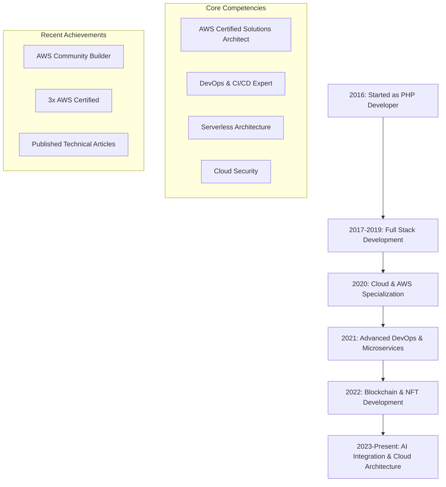

# <div align="center">👨‍💻 Rahul Ladumor | Senior Software Architect</div>

<div align="center">
  
[](https://git.io/typing-svg)

</div>

<div align="center">
    <a href="https://twitter.com/Rahul__ladumor">
        
    </a>
    <a href="https://www.linkedin.com/in/rahulladumor/">
        
    </a>
    <a href="mailto:rahuldladumor@gmail.com">
        
    </a>
    <a href="https://dev.to/rahulladumor">
        
    </a>
    <a href="https://medium.com/@ladumorrahul">
        
    </a>
    
</div>

## 💫 About Me

<div align="right">
  <a href="https://app.daily.dev/rahulladumor">
    
  </a>
</div>

```yaml
name: Rahul Ladumor
located_in: Surat, Gujarat, India
current_job: Senior Full Stack & Cloud Developer
education:
  [
    "Master of Science in Information Technology (2018-2020)",
    "Bachelor of Science in Information Technology (2016-2018)",
    "Veer Narmad South Gujarat University"
  ]
company: ProdigyBuild

fields_of_interests:
  [
    "Cloud Architecture",
    "DevOps",
    "Web Development",
    "IoT",
    "Mobile Development",
    "Blockchain"
  ]
  
technical_background:
  [
    "AWS Solutions Architect",
    "Serverless Expert",
    "Full-Stack Developer",
    "DevOps Engineer"
  ]
  
currently_learning: ["AI Integration", "Cloud Security"]
2024 Goals: ["Create 20+ Projects", "Contribute to Open Source"]
hobbies: ["Problem Solving", "Technical Writing", "Research"]
```

## 💻 Tech Stack
<p align="center">
  <a href="https://skillicons.dev">
    
  </a>
</p>

## 🌟 Expertise Areas

<div align="center">

| Cloud & DevOps | Development | Tools & Technologies |
|:---:|:---:|:---:|
|  |  |  |
|  |  |  |
|  |  |  |

</div>

## 📊 GitHub Analytics

<p align="center">
  
</p>

<div align="center">
  


</div>

## 🎯 Current Projects

<div align="center">
  
| Project | Description | Status |
|:---:|:---:|:---:|
| 🚀 Serverless Framework | Building scalable serverless applications | In Progress |
| 🔗 Blockchain Integration | Exploring Web3 possibilities | Planning |
| 🤖 IoT Platform | Connected device management system | Development |

</div>

## 🌱 Professional Journey & Learning Path


## 📫 Connect With Me

<div align="center">
  
[](https://linkedin.com/in/rahulladumor)
[](https://twitter.com/Rahul__ladumor)
[](mailto:rahuldladumor@gmail.com)

</div>

---

<div align="center">
  
  
  ### Show some ❤️ by starring some repositories!

📚 Latest Articles:
- [10 Trending Node.js Libraries and Frameworks](https://medium.com/@ladumorrahul)
- [Deep Dive into .then() Method in JavaScript](https://medium.com/@ladumorrahul)
- [Understanding Netflix's Backend Architecture](https://medium.com/@ladumorrahul)
  
  
</div>
