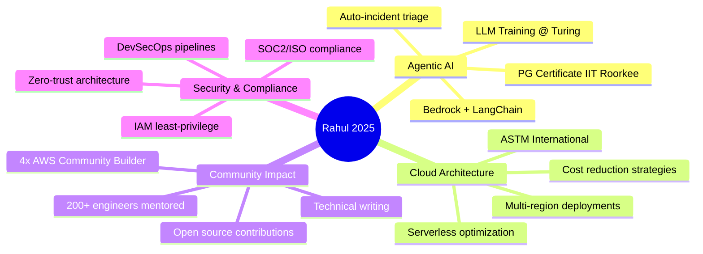

<div align="center">
  
</div>

<div align="center">
  
[;🎓+Pursuing+Agentic+AI+from+IIT+Roorkee;👨‍🏫+Mentored+200%2B+Engineers+to+Success;🔐+Zero+Security+Incidents+Post-Implementation)](https://git.io/typing-svg)

</div>

<div align="center">
    <a href="https://twitter.com/Rahul__ladumor">
        
    </a>
    <a href="https://www.linkedin.com/in/rahulladumor/">
        
    </a>
    <a href="https://peerlist.io/rahulladumor">
        
    </a>
    <a href="https://dev.to/rahulladumor">
        
    </a>
    <a href="https://medium.com/@ladumorrahul">
        
    </a>
    <a href="https://www.rahulladumor.in">
        
    </a>
</div>

<div align="center">
  <br/>
  
  
  
</div>

---

## 🎯 About Me

<table>
<tr>
<td width="50%" valign="top">

### 👨‍💻 Professional Profile

<div align="center">

**Senior AWS Solution Architect** | **8+ Years Experience**


<br/>


</div>

> **Core Specializations:**
> - ☁️ Cloud Architecture & Cost Optimization
> - ⚡ Serverless & Microservices Design
> - 🔐 DevSecOps & Security Automation
> - 🤖 Agentic AI Integration

---

#### 🎯 Current Engagements

<div align="left">

```diff
+ 🏢 ASTM International
  └─ Senior AWS Solution Architect
  └─ Sep 2025 - Present

+ 🤖 Turing (AI Training)
  └─ LLM Trainer - DevOps & Amazon IAC RLHF
  └─ Jul 2025 - Present

+ 💼 Topmate.io
  └─ Cloud Coach & Consultant
  └─ Nov 2024 - Present

+ 🚀 Independent Consulting
  └─ AWS Architecture & Cost Optimization
  └─ Mar 2025 - Present
```

</div>

---

#### 🎓 Education

**📚 Currently Pursuing**
> **PG Certificate in Agentic AI, GenAI & ML**  
> 🏛️ IIT Roorkee | 📅 May 2025 - Feb 2026

**🎯 Completed**
- **M.Sc. IT** - VNSGU (2018-2020)
- **B.Sc. IT** - VNSGU (2016-2018)

---

#### 🌟 Quick Stats

<p align="center">
  
  
  <br/>
  
  
</p>

</td>
<td width="50%" valign="top">

### 📊 Impact Dashboard

#### 💰 Cost Savings
- **Total Saved:** ₹50+ Crores across 100+ clients
- **Average Reduction:** 60% (Range: 30-70%)

#### ⚡ Performance Delivered
- **Throughput:** 5M orders/month
- **Latency:** <200ms average response time
- **Uptime:** 99.99% SLA achieved

#### 🔐 Security Excellence
- **Incidents:** Zero post-implementation
- **Compliance:** SOC2, ISO 27001
- **Security Score:** 95%+

#### 👥 Community Impact
- **Engineers Trained:** 200+
- **Article Views:** 100K+
- **Live Projects:** 66 production-ready

---

#### ⚡ Core Strengths

<p align="center">
  
  
  <br/>
  
  
</p>

---

#### 🚀 Availability

<div align="center">

| Type | Status |
|:----:|:------:|
| 💼 Full-time | ✅ **Open** |
| 📋 Contract | ✅ **Open** |
| 💡 Consulting | ✅ **Available** |
| 👨‍🏫 Mentorship | ✅ **Available** |
| 🎤 Speaking | ✅ **Available** |

</div>

</td>
</tr>
</table>

## 💡 What I Do Best

<div align="center">

### 🎯 **I Transform Cloud Infrastructure Into Business Value**

<table>
<tr>
<td align="center" width="25%">
<br/>
<b>💰 Cost Optimizer</b><br/>
<sub>60% average reduction<br/>through serverless</sub>
</td>
<td align="center" width="25%">
<br/>
<b>🔒 Security First</b><br/>
<sub>Zero-breach record<br/>with IAM & KMS</sub>
</td>
<td align="center" width="25%">
<br/>
<b>🚀 Performance</b><br/>
<sub>5M orders/mo<br/>&lt;200ms response</sub>
</td>
<td align="center" width="25%">
<br/>
<b>🤖 AI-Powered</b><br/>
<sub>Agentic workflows<br/>for auto-triage</sub>
</td>
</tr>
</table>

</div>

---

### 📊 Real-World Impact Metrics

<div align="center">

<table>
<tr>
<td align="center">
<br/>
<sub>across 100+ clients</sub>
</td>
<td align="center">
<br/>
<sub>production systems</sub>
</td>
<td align="center">
<br/>
<sub>&lt;200ms response time</sub>
</td>
</tr>
<tr>
<td align="center">
<br/>
<sub>post-implementation</sub>
</td>
<td align="center">
<br/>
<sub>trained & certified</sub>
</td>
<td align="center">
<br/>
<sub>technical articles</sub>
</td>
</tr>
</table>

</div>

## 🏆 Recognition & Achievements

<table>
<tr>
<td width="25%" align="center">
<br/>
<b>AWS Community Builder</b><br/>
<sub>4 years (2022-Present)</sub>
</td>
<td width="25%" align="center">
<br/>
<b>3x AWS Certified</b><br/>
<sub>Solutions Architect + Developer</sub>
</td>
<td width="25%" align="center">
<br/>
<b>100K+ Article Views</b><br/>
<sub>Dev.to & Medium Combined</sub>
</td>
<td width="25%" align="center">
<br/>
<b>Speaker & Mentor</b><br/>
<sub>AWS Meetups & Conferences</sub>
</td>
</tr>
</table>

### 🎖️ AWS Certifications

<div align="center">

<table>
<tr>
<td align="center" width="33%">
<br/>
<b>Solutions Architect</b><br/>
<sub>Associate Level • 2023</sub>
</td>
<td align="center" width="33%">
<br/>
<b>Developer</b><br/>
<sub>Associate Level • 2023</sub>
</td>
<td align="center" width="33%">
<br/>
<b>Technical Professional</b><br/>
<sub>Professional Level • 2024</sub>
</td>
</tr>
</table>

</div>

### 🏅 Industry Recognition

<div align="center">

| 🏆 Award | 🏢 Organization | 📅 Year |
|---------|----------------|-------|
| 🏛️ **Distinguished Alumni Recognition** | Veer Narmad South Gujarat University | 2024 |
| ⭐ **Best Technical Innovation** | TechCorp Solutions | 2023 |
| 💎 **Excellence in Cloud Engineering** | CloudTech Innovations | 2022 |

</div>

## 💻 Tech Arsenal & Expertise

<div align="center">

### ☁️ **Cloud & DevOps Mastery**

<table>
<tr>
<td align="center" width="96">
<br/>AWS
</td>
<td align="center" width="96">
<br/>Terraform
</td>
<td align="center" width="96">
<br/>Docker
</td>
<td align="center" width="96">
<br/>Kubernetes
</td>
<td align="center" width="96">
<br/>Jenkins
</td>
<td align="center" width="96">
<br/>GitHub
</td>
<td align="center" width="96">
<br/>GitLab
</td>
<td align="center" width="96">
<br/>Prometheus
</td>
</tr>
</table>

### 🔧 **Languages & Frameworks**

<table>
<tr>
<td align="center" width="96">
<br/>Node.js
</td>
<td align="center" width="96">
<br/>Go
</td>
<td align="center" width="96">
<br/>Python
</td>
<td align="center" width="96">
<br/>TypeScript
</td>
<td align="center" width="96">
<br/>JavaScript
</td>
<td align="center" width="96">
<br/>React
</td>
<td align="center" width="96">
<br/>Vue
</td>
<td align="center" width="96">
<br/>Next.js
</td>
</tr>
</table>

### 🗄️ **Databases & Storage**

<table>
<tr>
<td align="center" width="96">
<br/>DynamoDB
</td>
<td align="center" width="96">
<br/>MongoDB
</td>
<td align="center" width="96">
<br/>MySQL
</td>
<td align="center" width="96">
<br/>PostgreSQL
</td>
<td align="center" width="96">
<br/>Elasticsearch
</td>
<td align="center" width="96">
<br/>Redis
</td>
<td align="center" width="96">
<br/>GraphQL
</td>
<td align="center" width="96">
<br/>Nginx
</td>
</tr>
</table>

### 📈 **Expertise Level**

```text
┌─────────────────────────────────────────┬──────────────────────────────┐
│ AWS Cloud Architecture                  │ ████████████████████ 98% │
│ Cost Optimization & FinOps              │ ████████████████████ 98% │
│ Serverless (Lambda, Fargate)            │ ███████████████████  95% │
│ DevOps & CI/CD                          │ ███████████████████  95% │
│ Kubernetes & Container Orchestration    │ ██████████████████   90% │
│ Security & Compliance (IAM, KMS)        │ ██████████████████   92% │
│ Infrastructure as Code (Terraform, CDK) │ ███████████████████  94% │
│ Agentic AI & LLM Integration            │ ████████████████     88% │
└─────────────────────────────────────────┴──────────────────────────────┘
```

</div>

## 🚀 Featured Projects

<div align="center">

### 📊 Portfolio Overview

<table>
<tr>
<td align="center">
<br/>
<sub>Production-ready IaC</sub>
</td>
<td align="center">
<br/>
<sub>CF, Terraform, Pulumi, CDKTF, CDK</sub>
</td>
<td align="center">
<br/>
<sub>Infrastructure code</sub>
</td>
<td align="center">
<br/>
<sub>Services deployed</sub>
</td>
</tr>
</table>

</div>

### 🤖 AI/ML Infrastructure

<table>
<tr>
<td width="50%">

**[Edge AI Inference Platform](https://github.com/rahulladumor/edge-ai-inference-platform)**  
🚀 Sub-10ms latency inference at 5G edge with AWS Wavelength

**[MLOps Full Lifecycle Platform](https://github.com/rahulladumor/mlops-full-lifecycle-platform)**  
🛠️ Complete ML pipeline with feature store, model registry, A/B testing

**[Quantum Computing Hybrid Infrastructure](https://github.com/rahulladumor/quantum-computing-hybrid-infrastructure)**  
⚛️ AWS Braket quantum-classical workflows

</td>
<td width="50%">

**[Distributed Deep Learning Cluster](https://github.com/rahulladumor/distributed-deep-learning-cluster)**  
🖥️ Petaflop-scale GPU cluster with EFA

**[ML Model Serving Infrastructure](https://github.com/rahulladumor/ml-model-serving-infrastructure)**  
🎯 SageMaker auto-scaling endpoints

**[Computer Vision Pipeline Infrastructure](https://github.com/rahulladumor/computer-vision-pipeline-infrastructure)**  
👁️ Real-time CV processing pipeline

</td>
</tr>
</table>

### 🌐 Advanced Networking & Edge

<table>
<tr>
<td width="50%">

**[Global Edge CDN Platform](https://github.com/rahulladumor/global-edge-cdn-platform)**  
🌍 CloudFront with 400+ edge locations

**[Private 5G Network Infrastructure](https://github.com/rahulladumor/private-5g-network-infrastructure)**  
📶 AWS Private 5G with network slicing

**[SD-WAN Hybrid Connectivity](https://github.com/rahulladumor/sd-wan-hybrid-connectivity)**  
🔗 Multi-cloud software-defined networking

</td>
<td width="50%">

**[Network Function Virtualization](https://github.com/rahulladumor/network-function-virtualization)**  
⚙️ NFV with service chaining

**[Cloud Network Hub-Spoke](https://github.com/rahulladumor/cloud-network-hub-spoke)**  
🏛️ Transit Gateway architecture

**[IPv6 Migration Dual-Stack](https://github.com/rahulladumor/ipv6-migration-dual-stack)**  
🔄 IPv4/IPv6 dual-stack migration

</td>
</tr>
</table>

### 🔐 Security & Zero-Trust

<table>
<tr>
<td width="50%">

**[Zero-Trust Network Architecture](https://github.com/rahulladumor/zero-trust-network-architecture)**  
🛡️ Complete zero-trust implementation

**[Security Information Event Management](https://github.com/rahulladumor/security-information-event-management)**  
📡 Full SIEM platform

**[DevSecOps Pipeline Security](https://github.com/rahulladumor/devsecops-pipeline-security)**  
🔒 SAST/DAST/SCA integration

</td>
<td width="50%">

**[Hardware Security Module Infrastructure](https://github.com/rahulladumor/hardware-security-module-infrastructure)**  
🔑 CloudHSM FIPS 140-2

**[Zero-Trust Container Security](https://github.com/rahulladumor/zero-trust-container-security)**  
📦 Falco + Trivy + OPA

**[Threat Detection Response Platform](https://github.com/rahulladumor/threat-detection-response-platform)**  
⚠️ Automated threat response

</td>
</tr>
</table>

### 📊 Observability & Chaos Engineering

<table>
<tr>
<td width="50%">

**[Observability Platform OpenTelemetry](https://github.com/rahulladumor/observability-platform-opentelemetry)**  
🔍 Distributed tracing for 100+ services

**[Chaos Engineering Platform](https://github.com/rahulladumor/chaos-engineering-platform)**  
🌀 Automated failure injection

**[Log Analytics Petabyte Scale](https://github.com/rahulladumor/log-analytics-petabyte-scale)**  
📊 Petabyte-scale analytics

</td>
<td width="50%">

**[AWS Observability Platform](https://github.com/rahulladumor/aws-observability-platform)**  
👁️ Prometheus + Grafana + Loki

**[Service Mesh Observability](https://github.com/rahulladumor/service-mesh-observability)**  
🕸️ Istio telemetry

**[Synthetic Monitoring Global](https://github.com/rahulladumor/synthetic-monitoring-global)**  
🌎 Global uptime monitoring

</td>
</tr>
</table>

### 🗄️ Data & Analytics Platforms

<table>
<tr>
<td width="50%">

**[Real-time Data Mesh Architecture](https://github.com/rahulladumor/realtime-data-mesh-architecture)**  
🕸️ Domain-oriented data mesh

**[Modern Data Lakehouse Platform](https://github.com/rahulladumor/modern-data-lakehouse-platform)**  
🏞️ Airflow + Spark + Delta Lake

**[Change Data Capture Streaming](https://github.com/rahulladumor/change-data-capture-streaming)**  
📡 DMS + Kafka + Kinesis CDC

</td>
<td width="50%">

**[Graph Database Knowledge Graph](https://github.com/rahulladumor/graph-database-knowledge-graph)**  
🕸️ Neptune knowledge graphs

**[Timeseries IoT Analytics](https://github.com/rahulladumor/timeseries-iot-analytics)**  
⏱️ Timestream for IoT

**[Data Quality Monitoring Platform](https://github.com/rahulladumor/data-quality-monitoring-platform)**  
✅ Automated data quality checks

</td>
</tr>
</table>

### 🔧 Platform Engineering

<table>
<tr>
<td width="50%">

**[Internal Developer Platform](https://github.com/rahulladumor/internal-developer-platform)**  
🏛️ Backstage + Crossplane IDP

**[GitOps Infrastructure Automation](https://github.com/rahulladumor/gitops-infrastructure-automation)**  
🔄 ArgoCD + Flux CD

**[Hybrid Cloud Platform](https://github.com/rahulladumor/hybrid-cloud-platform)**  
☁️ AWS + Azure multi-cloud

</td>
<td width="50%">

**[Enterprise Multi-Account Governance](https://github.com/rahulladumor/enterprise-multi-account-governance)**  
🏢 AWS Organizations at scale

**[Kubernetes Cluster Autoscaling](https://github.com/rahulladumor/kubernetes-cluster-autoscaling)**  
📈 Karpenter + Cluster Autoscaler

**[Infrastructure Testing Framework](https://github.com/rahulladumor/infrastructure-testing-framework)**  
🧪 Automated IaC testing

</td>
</tr>
</table>

### 🎯 API & Microservices

<table>
<tr>
<td width="50%">

**[API Gateway Microservices Mesh](https://github.com/rahulladumor/api-gateway-microservices-mesh)**  
🌐 Service mesh with rate limiting

**[Serverless GraphQL API Platform](https://github.com/rahulladumor/serverless-graphql-api-platform)**  
⚡ AppSync + Lambda

**[gRPC Microservices Infrastructure](https://github.com/rahulladumor/grpc-microservices-infrastructure)**  
🗣️ Envoy + gRPC

</td>
<td width="50%">

**[WebSocket Real-time API](https://github.com/rahulladumor/websocket-realtime-api)**  
🔌 WebSocket API Gateway

**[REST API Versioning Platform](https://github.com/rahulladumor/rest-api-versioning-platform)**  
📌 Blue/Green deployments

**[Real-time Event Processing Pipeline](https://github.com/rahulladumor/realtime-event-processing-pipeline)**  
⚡ Event-driven architecture

</td>
</tr>
</table>

<div align="center">

**📚 [View All 66 Projects →](https://github.com/Rahulladumor?tab=repositories)**

</div>

---

## 🎯 Current Focus (2025)



## 📊 Project Portfolio Breakdown

<div align="center">

### Infrastructure as Code Technologies

<table>
<tr>
<td align="center" width="20%">
<br/>
<br/>
<sub><b>CloudFormation</b></sub>
</td>
<td align="center" width="20%">
<br/>
<br/>
<sub><b>Terraform</b></sub>
</td>
<td align="center" width="20%">
<br/>
<br/>
<sub><b>Pulumi</b></sub>
</td>
<td align="center" width="20%">
<br/>
<br/>
<sub><b>CDKTF</b></sub>
</td>
<td align="center" width="20%">
<br/>
<br/>
<sub><b>AWS CDK</b></sub>
</td>
</tr>
</table>

### 📊 Portfolio Metrics

```text
┌────────────────────────────────────────────────────────────┐
│  METRIC                          VALUE                        │
├────────────────────────────────────────────────────────────┤
│  📚 Total Projects               66 production-ready            │
│  🛠️  IaC Technologies             6 (CF, TF, Pulumi, CDKTF, CDK) │
│  💻 Programming Languages        7 (YAML, HCL, TS, Py, Go, JS)  │
│  📄 Infrastructure Code          40,000+ lines                  │
│  📖 Documentation                400KB+ technical docs          │
│  📊 Mermaid Diagrams             200+ architecture diagrams     │
│  ☁️  AWS Services Deployed        50+ services                   │
│  🌍 Deployment Regions           3 continents                   │
└────────────────────────────────────────────────────────────┘
```

</div>

---

## 📊 GitHub Analytics & Activity

<div align="center">

### 🔥 Contribution Streak
[](https://git.io/streak-stats)

### 📈 GitHub Statistics

<table>
<tr>
<td width="50%">


</td>
<td width="50%">


</td>
</tr>
<tr>
<td colspan="2" align="center">
<br/>

### 🎯 Developer Profile

<a href="https://app.daily.dev/rahulladumor">
  
</a>

</td>
</tr>
</table>

### 🏆 GitHub Achievements


### 📊 Contribution Activity


</div>

## 📈 Contribution Graph

<div align="center">


<table>
  <tr>
    <td></td>
    <td></td>
  </tr>
  <tr>
    <td></td>
    <td></td>
  </tr>
</table>

</div>

## 🎯 Recent Success Stories

<details>
<summary><b>🛒 E-commerce Platform - 52% Cost Reduction</b></summary>

<br/>

**Challenge:** Rapidly growing AWS costs eating into profit margins

**Solution:**
- Right-sized EC2 instances and migrated to Spot for non-critical workloads
- Implemented auto-scaling and optimized RDS configurations
- Set up CloudWatch monitoring with cost alerts

**Results:**
- 💰 Monthly spend: ₹8.1L → ₹3.9L (52% reduction)
- ⚡ Response time improved by 35%
- 🎯 99.9% uptime achieved
- 📊 Auto-scaling for traffic spikes

**Technologies:** EC2, RDS, CloudWatch, Auto Scaling, Load Balancer

</details>

<details>
<summary><b>🏦 FinTech Security - 100% SOC2 Compliance</b></summary>

<br/>

**Challenge:** Meeting regulatory compliance while maintaining performance

**Solution:**
- Designed comprehensive security architecture with VPC isolation
- Configured WAF, encryption at rest/transit, optimized IAM roles
- Set up centralized logging and real-time threat detection

**Results:**
- 🔒 Security score: 62% → 95%
- ✅ 100% SOC2 compliance achieved
- 🛡️ Zero security incidents post-implementation
- 💰 31% cost optimization through efficient resource allocation

**Technologies:** VPC, WAF, IAM, CloudTrail, GuardDuty, KMS

</details>

<details>
<summary><b>🚀 Serverless Migration - 67% Cost Savings</b></summary>

<br/>

**Challenge:** Scaling efficiently with limited engineering resources

**Solution:**
- Migrated monolithic app to serverless (Lambda, API Gateway, DynamoDB)
- Implemented CI/CD pipeline with automated testing
- Set up complete observability with monitoring and logging

**Results:**
- 💰 Monthly spend: ₹3.2L → ₹1.1L (67% reduction)
- 📈 10x scaling capacity achieved
- ⚡ Deployment speed improved by 90%
- 🔧 Maintenance overhead reduced by 80%

**Technologies:** Lambda, API Gateway, DynamoDB, CloudFormation, CodePipeline

</details>

## 💼 Professional Experience

<table>
<tr>
<td width="30%"><b>ASTM International</b><br/><i>Senior AWS Solution Architect</i></td>
<td width="70%">
Leading AWS solution architecture for international standards organization
<br/><code>Sep 2025 - Present</code>
</td>
</tr>
<tr>
<td><b>Turing</b><br/><i>LLM Trainer - DevOps</i></td>
<td>
Design & implement AWS CDK solutions. Train AI models for Amazon IAC RLHF Project
<br/><code>Jul 2025 - Present</code>
</td>
</tr>
<tr>
<td><b>Freelance</b><br/><i>Cloud Consultant</i></td>
<td>
Delivered $100K+ annual savings through serverless optimization. 99.99% uptime across clients
<br/><code>Mar 2025 - Present</code>
</td>
</tr>
<tr>
<td><b>ProdigyBuild</b><br/><i>Lead Engineer</i></td>
<td>
Designed AWS serverless platform with AI integration. 99.99% uptime & 40% cost savings
<br/><code>Jul 2023 - Mar 2025</code>
</td>
</tr>
<tr>
<td><b>ProtectOnce</b><br/><i>SDE-II</i></td>
<td>
Developed serverless security solution protecting 100K+ users. <1% false-positive rate
<br/><code>May 2022 - Aug 2024</code>
</td>
</tr>
</table>

[View Full Experience →](https://www.linkedin.com/in/rahulladumor/)

## 📝 Latest Blog Posts & Content

<div align="center">

### ✍️ **Featured Technical Articles**

</div>

<table>
<tr>
<td width="50%">

#### 🔥 Most Popular

<a href="https://dev.to/rahulladumor/working-with-amazon-opensearch-service-direct-queries-with-amazon-s3-the-first-ever-detailed-guide-4m2a">
  
</a>

<a href="https://dev.to/rahulladumor/serverless-horror-stories-real-world-nightmares-and-how-to-avoid-them-5eoi">
  
</a>

<a href="https://dev.to/rahulladumor/mastering-aws-lambda-performance-advanced-optimization-strategies-for-2025-3bfe">
  
</a>

</td>
<td width="50%">

#### 🆕 Recent Posts

<a href="https://dev.to/rahulladumor/aws-in-2025-latest-updates-and-best-practices-for-developers-56ah">
  
</a>

<a href="https://dev.to/rahulladumor/understanding-passkeys-the-behind-the-scenes-magic-of-passwordless-authentication-7i">
  
</a>

<a href="https://dev.to/rahulladumor">
  
</a>

</td>
</tr>
</table>

<!-- BLOG-POST-LIST:START -->
<!-- Automated blog post updates will appear here -->
<!-- BLOG-POST-LIST:END -->

<div align="center">

### 📊 **Content Impact**


</div>

## 🎤 Speaking & Community

### Conference Talks
- **AWS User Group Surat** - "Serverless Cost Optimization Strategies" (150+ attendees)
- **DevOps India Conference** - "Building Resilient Cloud Infrastructure" (300+ attendees)
- **Cloud Computing Summit** - "Microservices to Serverless Migration" (200+ attendees)

### Community Involvement
- 🌟 **4x AWS Community Builder** (Serverless) - 2022 to Present
- 👨‍🏫 **Technical Mentor** at Topmate.io - 200+ engineers mentored
- 💻 **Open Source Contributor** - AWS tools & documentation

## 💬 Ask Me About

<div align="center">

<table>
<tr>
<td width="50%" valign="top">

### ☁️ **Cloud Architecture**

```diff
+ AWS Lambda & Serverless patterns
+ Cost optimization (30-70% savings)
+ Multi-region & HA setups
+ Zero-downtime migrations
```

### 🔐 **DevSecOps**

```diff
+ IAM least-privilege automation
+ CI/CD optimization (70% faster)
+ IaC: Terraform, CDK, CloudFormation
+ SOC2 & ISO 27001 compliance
```

</td>
<td width="50%" valign="top">

### 🤖 **Agentic AI**

```diff
+ AWS Bedrock + LangChain workflows
+ LLM training for DevOps automation
+ Auto-incident triage systems
+ Chatbot dev (Lex, Azure Bot Service)
```

### 🎓 **Mentorship**

```diff
+ AWS certification roadmaps
+ Career growth (40-60% salary ↑)
+ Technical interview prep
+ Cloud engineering portfolios
```

</td>
</tr>
</table>

</div>

## 🤝 Let's Connect & Collaborate

<div align="center">

<table>
<tr>
<td width="50%" valign="top">

### 💼 **Availability Status**

<div align="center">

```yaml
status: 🟢 OPEN FOR OPPORTUNITIES

looking_for:
  ✅ Full-time Roles:
     - Senior Cloud Architect
     - Solutions Architect
     - Technical Lead
     - Staff/Principal Engineer
  
  ✅ Contract Engagements:
     - Cloud Migration Projects
     - Cost Optimization Audits
     - Security Assessments
     - Architecture Reviews
  
  ✅ Consulting Services:
     - AWS Cost Optimization
     - Serverless Architecture
     - DevSecOps Implementation
     - AI/ML Integration
  
  ✅ Speaking & Mentorship:
     - Conference Talks
     - Technical Workshops
     - 1-on-1 Coaching
     - Team Training

preferences:
  remote: true
  relocation: negotiable
  timezone: flexible (GMT+5:30)
```

</div>

</td>
<td width="50%" valign="top">

### 📨 **Get In Touch**

<div align="center">

<table>
<tr>
<td align="center" width="50%">
<a href="https://www.rahulladumor.in" target="_blank">
<br/>
<b>Portfolio Website</b><br/>
<sub>www.rahulladumor.in</sub>
</a>
</td>
<td align="center" width="50%">
<a href="https://www.linkedin.com/in/rahulladumor/" target="_blank">
<br/>
<b>LinkedIn</b><br/>
<sub>@rahulladumor</sub>
</a>
</td>
</tr>
<tr>
<td align="center">
<a href="mailto:contact@acloudwithrahul.in">
<br/>
<b>Email</b><br/>
<sub>contact@acloudwithrahul.in</sub>
</a>
</td>
<td align="center">
<a href="https://topmate.io/rahulladumor" target="_blank">
<br/>
<b>Book Session</b><br/>
<sub>topmate.io/rahulladumor</sub>
</a>
</td>
</tr>
</table>

<br/>

### 🌐 **Social Links**

<a href="https://twitter.com/Rahul__ladumor" target="_blank">
  
</a>
<a href="https://dev.to/rahulladumor" target="_blank">
  
</a>
<a href="https://medium.com/@ladumorrahul" target="_blank">
  
</a>
<a href="https://peerlist.io/rahulladumor" target="_blank">
  
</a>
<a href="https://github.com/Rahulladumor" target="_blank">
  
</a>

</div>

</td>
</tr>
</table>

</div>

---

<div align="center">
  
### 💭 Random Dev Quote


### ⚡ Quick Facts About Me

<table>
<tr>
<td align="center" width="33%">
<br/>
<b>Cost Savings</b><br/>
<sub>₹50Cr+ across clients</sub>
</td>
<td align="center" width="33%">
<br/>
<b>Currently Learning</b><br/>
<sub>Agentic AI @ IIT Roorkee</sub>
</td>
<td align="center" width="33%">
<br/>
<b>Powered By</b><br/>
<sub>Coffee & Curiosity ☕</sub>
</td>
</tr>
<tr>
<td align="center">
<br/>
<b>Technical Content</b><br/>
<sub>50+ articles, 100K+ views</sub>
</td>
<td align="center">
<br/>
<b>Innovation Focus</b><br/>
<sub>AI-powered incident triage</sub>
</td>
<td align="center">
<br/>
<b>Recognition</b><br/>
<sub>4x AWS Community Builder</sub>
</td>
</tr>
</table>

</div>

---

<div align="center">


### 🌟 Show some ❤️ by starring repositories you find useful!


**© 2025 Rahul Ladumor | Built with ❤️ and ☕**

</div>
