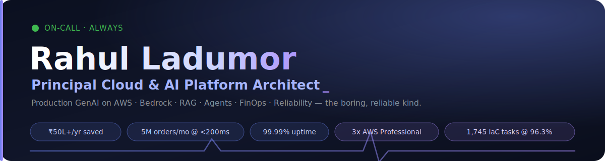

<div align="center">
  
</div>

<div align="center">
    <a href="https://www.linkedin.com/in/rahulladumor/">
        
    </a>
    <a href="https://www.rahulladumor.com">
        
    </a>
    <a href="https://infratales.com">
        
    </a>
    <a href="https://dev.to/rahulladumor">
        
    </a>
    <a href="https://twitter.com/Rahul__ladumor">
        
    </a>
    <a href="https://topmate.io/rahulladumor">
        
    </a>
</div>

<div align="center">
  <br/>
  
  
  <br/><br/>
  
  
  
  <br/><br/>
  
  
  
</div>

---

## 🚀 TL;DR - 30 Second Snapshot

<div align="center">

| 👨‍💼 **Who Am I?** | 📊 **My Impact** | 🔧 **Currently** |
|:------------------|:-----------------|:----------------------------|
| **Principal Cloud & AI Platform Architect** | ⚡ **5M orders/mo** @ <200ms, 99.99% uptime | 🤖 **Agentic AI** — PG Certificate, IIT Roorkee |
| 📅 9+ Years (since 2016) | ✅ **1,745 IaC tasks** validated @ 96.3% | 🧰 **IdleLens** — AWS cloud-waste scanner SaaS |
| 🏗️ Founder, **InfraTales** | 💰 **₹50L+/yr** client AWS waste removed | 🏛️ **ASTM International** — Valkey migration |
| 🎯 4x AWS Community Builder | 🔐 Production GenAI on Bedrock + SageMaker | ✍️ **InfraTales.com** — AWS/AI war stories |
| 🤝 Consulting + Fractional | 🌍 US · Japan · Canada · Thailand · Indonesia | 🎓 LLM/IaC RLHF @ Turing (Amazon) |

<br/>


<br/>

**💼 Open for:** GenAI Infrastructure · Platform & Reliability · Cost (FinOps) · Fractional Architect

[🎯 About](#-about-me) • [🎖️ Certifications](#-certifications) • [💻 Tech Stack](#-tech-arsenal--expertise) • [🚀 Projects](#-selected-projects) • [🧰 Products](#-products--builds) • [🧭 Work History](#-work-history)

</div>

---

## 🎯 About Me

> **AI Platform & Solutions Architect with 9+ years building production AWS platforms, serverless backends, and GenAI infrastructure.** I work best with teams running serious systems under multi-region, high-traffic, cost-sensitive, on-call reality — where reliability and governance actually matter.
>
> **Available for consulting and fractional engagements** as an AWS cost optimization (FinOps) consultant, Amazon Bedrock / production RAG engineer, serverless & platform reliability architect, and forward-deployed AI engineer.

<div align="center">
<table>
<tr>
<td align="center" width="25%"><br/><b>💰 Cost Optimizer</b><br/><sub>FinOps that sticks</sub></td>
<td align="center" width="25%"><br/><b>🔒 Security First</b><br/><sub>tight IAM, small blast radius</sub></td>
<td align="center" width="25%"><br/><b>🚀 Reliability</b><br/><sub>5M orders/mo · 99.99%</sub></td>
<td align="center" width="25%"><br/><b>🤖 GenAI Infra</b><br/><sub>Bedrock · RAG · agents</sub></td>
</tr>
</table>
</div>

<table>
<tr>
<td width="60%" valign="top">

### 🌙 3:47 AM — the call I get hired for

Most engagements start the same way. Something is on fire, or the AWS bill stopped making sense, or a GenAI system is falling apart under real traffic.

I find what is bleeding, stop it, and make sure it cannot happen again.

> **Recent:** a shared Redis pinned at **100% CPU with 1,620 open connections**, degrading a specifications-indexing pipeline. Root cause: a `KEYS *` call in Lambda, no connection pooling, hardcoded credentials. I shipped a **cost-neutral** migration to a dedicated Valkey 7.2 cluster — with a full rollback path, credentials remediated.

I build systems that survive real traffic, real failure modes, and real cloud bills. Not demos. The boring, reliable kind that does not wake you up at 3 AM.

</td>
<td width="40%" valign="top">

### 🎓 Education

**PG Certificate — Agentic AI, GenAI & ML**
🏛️ IIT Roorkee · 2025–2026

**M.Sc. Information Technology**
VNSGU Surat · 2018–2020

**B.Sc. Information Technology**
VNSGU Surat · 2016–2018

🏅 Distinguished Alumni Recognition (60th Anniversary)

📍 Surat, India · Remote-first · IST + US

</td>
</tr>
</table>

### 🛠️ Four things teams hire me for

<table>
<tr>
<td width="50%" valign="top">

**🤖 GenAI Infrastructure**
Bedrock & SageMaker pipelines built for real traffic. RAG, agent workflows, guardrails, and evals that hold up past demo day — chunking, embedding selection, reranking, RAGAS + LangSmith loops.

**💰 Cost Control (FinOps)**
I find the spend your AWS bill is quietly bleeding and stop it. Token budgets, spend governance, right-sizing, S3 tiering, connection pooling. FinOps that actually sticks.

</td>
<td width="50%" valign="top">

**🏗️ Platform & Reliability**
Multi-region systems with proper observability, incident playbooks, and safe rollouts. Lambda Powertools, structured logging, tight IAM scoping to keep blast radius small.

**🚀 Cloud Delivery**
Terraform, CDK, Kubernetes, CI/CD. Shipped fast, without breaking prod. Blue-green and canary by default, rollback planned before the deploy.

</td>
</tr>
</table>

> **How I weigh a system:** Cost — what does this become at 10x scale? Reliability — what happens when one component fails? Blast radius — how much breaks at once? Ops load — who maintains this at 2 AM? Time to ship — is this overbuilt? **I prefer boring but reliable over clever but fragile. Every time.** If something is a bad idea, I say it directly and explain the consequence.

---

## 🎖️ Certifications

<div align="center">

<table>
<tr>
<td align="center" width="33%">
<br/>
<b>Solutions Architect</b><br/><sub>Professional · Feb 2026</sub>
</td>
<td align="center" width="33%">
<br/>
<b>GenAI Developer</b><br/><sub>Professional · Jan 2026</sub>
</td>
<td align="center" width="33%">
<br/>
<b>DevOps Engineer</b><br/><sub>Professional</sub>
</td>
</tr>
</table>

<br/>


<br/><br/>


<br/><br/>

**3x AWS Professional** · Developer Associate · HashiCorp Terraform Associate · 4x AWS Community Builder (Serverless)

</div>

---

## 💻 Tech Arsenal & Expertise

<div align="center">

### ☁️ Cloud, GenAI & DevOps

<table>
<tr>
<td align="center" width="96"><br/>AWS</td>
<td align="center" width="96"><br/>Terraform</td>
<td align="center" width="96"><br/>Docker</td>
<td align="center" width="96"><br/>K8s</td>
<td align="center" width="96"><br/>Actions</td>
<td align="center" width="96"><br/>Prometheus</td>
<td align="center" width="96"><br/>Grafana</td>
<td align="center" width="96"><br/>Pulumi</td>
</tr>
</table>

### 🤖 GenAI & Data

<p align="center">


</p>

### 🔧 Languages & Runtime

<table>
<tr>
<td align="center" width="96"><br/>Python</td>
<td align="center" width="96"><br/>Node.js</td>
<td align="center" width="96"><br/>TypeScript</td>
<td align="center" width="96"><br/>Go</td>
<td align="center" width="96"><br/>GraphQL</td>
<td align="center" width="96"><br/>Swift</td>
<td align="center" width="96"><br/>Next.js</td>
<td align="center" width="96"><br/>DynamoDB</td>
</tr>
</table>

### 📈 Expertise Level

```text
┌─────────────────────────────────────────┬──────────────────────────────┐
│ AWS Cloud Architecture                  │ ████████████████████ 98% │
│ Cost Optimization & FinOps              │ ████████████████████ 98% │
│ Serverless (Lambda, Fargate)            │ ███████████████████  96% │
│ GenAI Infra (Bedrock, RAG, Agents)      │ ██████████████████   92% │
│ IaC (Terraform, CDK, Pulumi, CFN)       │ ███████████████████  95% │
│ Platform & Reliability / Observability  │ ██████████████████   93% │
│ Security & Compliance (IAM, KMS)        │ ██████████████████   92% │
│ Kubernetes & Containers (EKS, Fargate)  │ ██████████████████   90% │
└─────────────────────────────────────────┴──────────────────────────────┘
```

</div>

---

## 🚀 Selected Projects

Real systems under real load. Client work is described, not linked.

<table>
<tr>
<td width="50%" valign="top">

**🍗 KFC Thailand — Omnichannel Ordering**
Event-driven microservices on EKS + Kafka. **5M+ orders/month, sub-200ms, 99.99% uptime** at peak. Blue-green deploys, 20+ releases/week. `Node.js · Go · Kubernetes · Terraform`

**🧪 Turing — IaC Automation Platform**
12-repo ecosystem validating **1,745 infrastructure tasks @ 96.3%** across 5 IaC frameworks. CI/CD auto-fixer agent, universal repo-validator, 8-phase curator pipeline. `Terraform · CDK · CDKTF · Pulumi · CFN`

**🔎 Bedrock RAG Pipeline**
Production RAG on Amazon Bedrock — chunking strategy, embedding selection, reranking, RAGAS eval loop. Lifted answer relevance for a B2B SaaS client. `Bedrock · OpenSearch · RAGAS · LangSmith`

</td>
<td width="50%" valign="top">

**🍽️ Qraved Indonesia — Discovery & Loyalty**
PHP monolith → serverless GraphQL on Lambda + DynamoDB. **3x search throughput, 30% lower infra cost, +18% CTR, +22% DAU** via Amazon Personalize.

**🧠 ProdigyBuild — ML Platform**
SageMaker Pipelines, MLflow, DVC on EKS + Terraform. Real-time inference with auto-scaling, automated retraining, rollback + validation gates.

**🛡️ ProtectOnce — Security Platform**
Developer-first API security, single-line integration. Real-time detection on Lambda, API Gateway, WAF. eBPF kernel-level monitoring across Linux.

</td>
</tr>
</table>

<div align="center">

**Open-source infrastructure → [InfraTales org (27+ projects)](https://github.com/orgs/InfraTales/repositories)**

</div>

---

## 🧰 Products & Builds

When I am not on a client system, I build my own. Honest state of each.

<table>
<tr>
<td width="33%" valign="top">

### 🔍 IdleLens
`BUILDING · v0.6.0`
AWS cloud-waste scanner SaaS — the product version of the FinOps work I do by hand. 17 scanners, 76 tests, multi-account UI, sign-in flow. Next: Slack integration, auto-scan scheduler, weekly digest.
`Next.js · React 19 · TS · Fargate`

</td>
<td width="33%" valign="top">

### 📰 InfraTales.com
`LAUNCHED · 7 Apr 2026`
AWS & AI infrastructure content platform. Ghost v6 on Lightsail, 17 pages, validator pipeline tying repo + diagram + draft. 8 posts live, cross-posted to dev.to & Hashnode. Paid tier $5/mo or $50/yr.

</td>
<td width="33%" valign="top">

### 🧠 AI Second-Brain
`BUILDING`
Personal knowledge dashboard. Extraction layer done (37/37 tests), UI ~75%. Single-priority model (overdue / decide / today / backlog) with cross-meeting dedupe.
`Next.js · React · TS`

</td>
</tr>
</table>

<details>
<summary><b>Also built this year (parked / archived)</b></summary>

<br/>

- **Second Brain** `PARKED` — entity knowledge graph, graph-aware RAG (2-hop), temporal awareness, hybrid 70/30 search. `Python · SQLite + sqlite-vec + FTS5 · FastAPI`
- **Meeting Recorder** `PARKED` — macOS menu-bar capture (dual audio, live transcription) + Python processor (MLX Whisper, pyannote, 3-pass summarization).
- **Gmail Smart Organizer** `BUILT` — AI email classification; n8n workflow + Python bulk backfill for 50K+ emails across 8 categories.
- **LinkedIn Lab** `PARKED` — content/automation platform. `Node.js · TS · Prisma · BullMQ` (~327 tests).
- **Fluent** `PARKED` — macOS interview/meeting assistant with overlay UI. `Swift`
- **finance-app-ps** `ARCHIVED` — personal finance dashboard, 27 bank parsers, money in paise. `FastAPI · SQLAlchemy · React`

> I kill projects on purpose too. Shipping is a decision — so is stopping.

</details>

---

## 🧭 Work History

| Period | Role · Company | Highlights |
|:-------|:---------------|:-----------|
| **Mar 2023 – Present** | Independent Cloud & AI Consultant · *Freelance* | Serverless cutting client cost 30–40%; ₹50L+ waste removed; Bedrock RAG for fintech & e-commerce |
| **Nov 2024 – Present** | Cloud & AI Career Coach · *Topmate.io* | 1:1 mentoring — AWS architecture, GenAI, Terraform |
| **Sep 2025 – Present** | Senior AWS Solutions Architect · *ASTM Intl* (via Euphoric Thought) | Valkey 7.2 migration, EKS, secure multi-account, cost-neutral fixes |
| **Jul 2025 – Feb 2026** | AI Infra Platform Engineer · *Turing* | Amazon IAC RLHF — 12-repo IaC, 1,745 tasks @ 96.3%, 5 frameworks |
| **2025 – Apr 2026** | AI Platform / Backend Lead · *MAIA* (Munn & Affiliates / Tektonik, Canada) | AI procurement marketplace — RAG on Pinecone, n8n, LiveKit voice agent |
| **Jan 2025 – Mar 2025** | Senior Software Engineer · *NTT* (Tokyo) | Short AWS platform contract across JST |
| **Jul 2023 – Mar 2025** | Lead Platform Engineer · *ProdigyBuild* (via Virgo, SF Bay) | Serverless platform + ML pipeline; 99.9% uptime, 40% cost cut |
| **May 2022 – Aug 2024** | SDE-II · *ProtectOnce* (via Codewits, SF Bay) | Dev-first security; eBPF kernel-level monitoring |
| **Feb 2022 – Dec 2023** | Senior Software Engineer · *Imaginato* (via DIV Tech, China) | KFC Thailand 5M+ orders/mo; Qraved monolith → serverless |
| **Apr 2022 – Jun 2022** | Blockchain Developer · *PrimeLab* (US) | Go microservices for wallet/transaction mgmt |
| **Aug 2021 – May 2022** | Senior Software Developer · *NDS Global* (India) | Conversational AI on AWS Lex + Azure Bot |
| **Jan 2020 – Jul 2021** | Cloud Developer · *AppGambit* (Surat) | 1M+ req/min on ECS/EKS/Fargate; MTTR cut 20% |
| **Apr 2016 – Jul 2019** | Bynebits → Creative Infotech (Indore/Surat) | First roles — Node.js + Lambda, PHP e-commerce |

<div align="center">

[View full profile on LinkedIn →](https://www.linkedin.com/in/rahulladumor/)

</div>

---

## 🏗️ InfraTales — My Open Source Organization

<div align="center">

<a href="https://github.com/InfraTales">
  
</a>

### **[InfraTales](https://github.com/InfraTales)** — Production-Ready AWS Infrastructure & War Stories

[](https://infratales.com)
[](https://github.com/InfraTales)
[](https://infratales.com)

</div>

> **I founded [InfraTales](https://github.com/InfraTales)** to democratize enterprise-grade AWS infrastructure and tell the real war stories — what broke, what it cost, what changed. Launched **7 Apr 2026** (Ghost v6 on Lightsail). Every project is battle-tested, documented with cost analysis in ₹, and production-ready.

<details>
<summary><b>🌟 Featured InfraTales Projects (click to expand)</b></summary>

<br/>

| Category | Project | Description | Tech |
|:---------|:--------|:------------|:-----|
| 🏢 **Core** | [enterprise-secure-webapp-3tier](https://github.com/InfraTales/enterprise-secure-webapp-3tier) | Production 3-Tier Architecture | CDK Go |
| 🏢 **Core** | [resilient-webapp-3tier](https://github.com/InfraTales/resilient-webapp-3tier) | Fault-Tolerant 3-Tier | CDK Java |
| 🔒 **Security** | [zero-trust-network-architecture](https://github.com/InfraTales/zero-trust-network-architecture) | BeyondCorp Implementation | CDK |
| 💰 **Cost** | [aws-cost-optimization-50l-case-study](https://github.com/InfraTales/infratales-aws-cost-optimization-50l-case-study) | ₹50L/year Savings | Terraform |
| 🤖 **ML** | [mlops-full-lifecycle-platform](https://github.com/InfraTales/mlops-full-lifecycle-platform) | End-to-End ML Platform | CDK |

</details>

<div align="center">

**[→ Explore all InfraTales projects](https://github.com/orgs/InfraTales/repositories)**

[](https://github.com/sponsors/rahulladumor)

</div>

---

## ✍️ Content & Community

<table>
<tr>
<td width="50%" valign="top">

### 📰 Writing & Speaking
- **InfraTales** — AWS/AI war stories in a senior-engineer, ownership voice. 8 posts live, cross-posted to dev.to & Hashnode.
- **VNSGU AI Agents Workshop** (Apr 2026) — full slide deck, hands-on exercises, Python agents on the Claude API.
- **~11K LinkedIn followers** — practical AWS, GenAI & FinOps.

</td>
<td width="50%" valign="top">

### 🔥 Popular Articles
[](https://dev.to/rahulladumor/working-with-amazon-opensearch-service-direct-queries-with-amazon-s3-the-first-ever-detailed-guide-4m2a)
[](https://dev.to/rahulladumor/serverless-horror-stories-real-world-nightmares-and-how-to-avoid-them-5eoi)
[](https://dev.to/rahulladumor/mastering-aws-lambda-performance-advanced-optimization-strategies-for-2025-3bfe)
[](https://dev.to/rahulladumor)

</td>
</tr>
</table>

---

## 📊 GitHub Analytics

<div align="center">

<!-- STATS:START (auto-updated weekly by .github/workflows/update-stats.yml) -->
<p align="center">
  
  
  
</p>

<sub><b>Most-used languages</b></sub>

<p align="center">
  
  
  
  
  
  
</p>
<!-- STATS:END -->

[](https://github.com/DenverCoder1/github-readme-streak-stats)

<a href="https://app.daily.dev/rahulladumor"></a>

<picture>
  <source media="(prefers-color-scheme: dark)" srcset="https://raw.githubusercontent.com/rahulladumor/Rahulladumor/output/github-snake-dark.svg"/>
  <source media="(prefers-color-scheme: light)" srcset="https://raw.githubusercontent.com/rahulladumor/Rahulladumor/output/github-snake.svg"/>
  
</picture>

</div>

---

## ❓ How I Can Help

<details open>
<summary><b>Looking for an AWS cost optimization / FinOps consultant?</b></summary>

<br/>

Yes. I run AWS cost audits and FinOps engagements that remove **₹50L+/yr** of cloud waste — right-sizing, S3 tiering, connection pooling, GenAI token-budget governance, and spend guardrails that actually stick. → [Book a call](https://topmate.io/rahulladumor)

</details>

<details>
<summary><b>Need an Amazon Bedrock / production RAG consultant?</b></summary>

<br/>

I build production GenAI infrastructure on **AWS Bedrock and SageMaker** — RAG pipelines, agent workflows, guardrails, and LLM evaluations (RAGAS, LangSmith) that hold up past demo day, not just in a notebook.

</details>

<details>
<summary><b>Want a fractional cloud / platform architect for hire?</b></summary>

<br/>

I take on **fractional architect and consulting** engagements — architecture reviews, multi-region reliability, AWS Well-Architected audits, and technical advisory. 9+ years, 3x AWS Professional, 4x AWS Community Builder.

</details>

<details>
<summary><b>Forward-deployed engineer for AI / customer-facing delivery?</b></summary>

<br/>

I work **forward-deployed** — embedding with your engineers to take AI and cloud features from prototype to production under real traffic, real failure modes, and on-call reality.

</details>

<details>
<summary><b>AWS serverless or platform reliability help?</b></summary>

<br/>

**Serverless architecture** (Lambda, API Gateway, DynamoDB, Step Functions, EventBridge), multi-region high availability, observability, and safe blue-green / canary rollouts with rollback planned before the deploy.

</details>

---

## 🤝 Work With Me

<div align="center">

I'm open to **consulting engagements and fractional architect roles** — GenAI infrastructure, platform & reliability, and FinOps.

```yaml
engagements:
  - GenAI infrastructure: Bedrock / RAG / agents, guardrails, evals
  - Platform & reliability: multi-region, observability, safe rollouts
  - Cost (FinOps): audits, governance, token + spend ceilings
  - Fractional architect: design reviews, technical advisory
preferences:
  remote: true
  timezones: IST + US
```

<a href="mailto:rahuldladumor@gmail.com">
  
</a>
<a href="https://www.rahulladumor.com">
  
</a>
<a href="https://www.linkedin.com/in/rahulladumor/">
  
</a>
<a href="https://topmate.io/rahulladumor">
  
</a>

</div>

---

<div align="center">

### 💭 Dev Quote & Quick Facts


<table>
<tr>
<td align="center" width="33%"><br/><b>₹50L+/yr</b><br/><sub>AWS waste removed</sub></td>
<td align="center" width="33%"><br/><b>Currently Learning</b><br/><sub>Agentic AI @ IIT Roorkee</sub></td>
<td align="center" width="33%"><br/><b>Powered By</b><br/><sub>Coffee & curiosity ☕</sub></td>
</tr>
</table>

<br/>


⭐ Star a repo • 🔔 Follow for updates • 🤝 Reach out to collaborate

**© 2026 Rahul Ladumor · Principal Cloud & AI Platform Architect**

</div>
