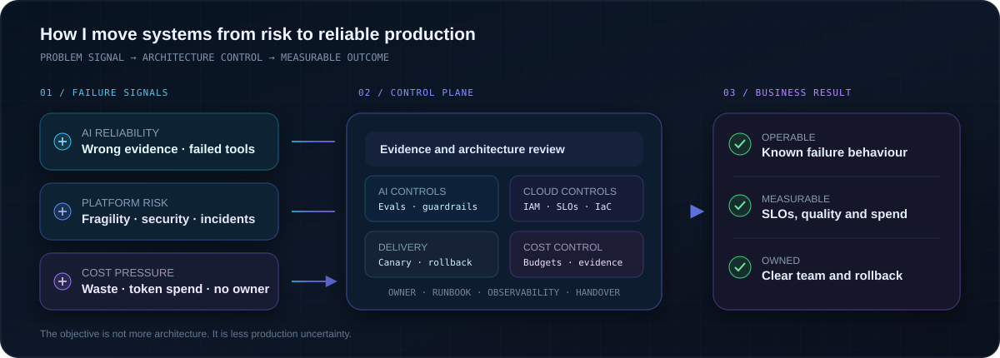

  

<h1 align="center">Principal Cloud &amp; AI Platform Architect</h1>

  Production GenAI on AWS · RAG and AI Agents · Serverless Architecture · Platform Engineering · FinOps

  
  
  
  

[Website](https://www.rahulladumor.com) · [LinkedIn](https://www.linkedin.com/in/rahulladumor/) · [InfraTales](https://infratales.com) · [Book an architecture call](https://topmate.io/rahulladumor)

[Expertise](#aws-and-ai-architecture-services) · [Production evidence](#selected-production-evidence) · [Current builds](#what-i-am-building-now) · [Open source](#open-source-evidence) · [Contact](#hire-an-aws-and-ai-platform-architect)

---

## Production GenAI, AWS platform engineering and AI agent architecture

I take AI and cloud systems from "it works" to "we can operate this safely."

I am a Principal Cloud and AI Platform Architect with 9+ years of production engineering experience. I design, modernise and repair production GenAI platforms, RAG systems, AI agents, serverless AWS architectures, cloud infrastructure and developer platforms where reliability, security, cost optimisation and operational ownership all matter.

Teams usually bring me in when:

- an AI agent or RAG workflow works in a demo but loses context, retrieves the wrong evidence, or fails unpredictably in production
- an AWS platform has become expensive, fragile, difficult to secure, or painful to change
- a high-stakes architecture decision needs a senior owner who can balance delivery speed against long-term operational risk

| Production scale | Cost impact | Professional evidence |
|:--:|:--:|:--:|
| **5M+ orders/month** at sub-200ms and 99.99% uptime | **₹50L+/year** in avoidable AWS spend removed | **3x AWS Professional** · **4x AWS Community Builder** |

> My default is simple: boring but reliable beats clever but fragile. Cost, failure behaviour, ownership, observability, and rollback should be clear before production traffic arrives.

---

## AWS and AI architecture services

<table>
<tr>
<td width="33%" valign="top">

### Production GenAI, RAG and AI agents

Amazon Bedrock, RAG, agents, evaluation, guardrails, observability, tool execution, prompt governance, trace governance, and production deployment.

</td>
<td width="33%" valign="top">

### AWS, serverless and platform reliability

Serverless and container platforms, multi-region design, IAM boundaries, incident reduction, safe releases, observability, and rollback planning.

</td>
<td width="33%" valign="top">

### AWS cost optimisation and FinOps

Architecture-led FinOps, right-sizing, storage lifecycle design, connection and compute optimisation, token budgets, and durable spend guardrails.

</td>
</tr>
</table>

 

  

---

## Selected production evidence

### KFC Thailand - omnichannel ordering at national scale

| | |
|---|---|
| **Challenge** | Support high-volume ordering across channels without sacrificing latency, release safety, or availability. |
| **Scale** | 5M+ orders/month, sub-200ms response time, 99.99% uptime, and 20+ releases/week. |
| **Architecture** | Event-driven services on Kubernetes with Kafka, Terraform, blue-green delivery, and production observability. |
| **Result** | The platform handled peak demand while maintaining both delivery speed and operational reliability. |

### AWS cost optimisation - ₹50L+ annual waste removed

| | |
|---|---|
| **Challenge** | Cloud spend had grown without enough evidence, ownership, or controls to prevent waste from returning. |
| **Scope** | Compute, storage, databases, serverless concurrency, connection behaviour, and operational waste. |
| **Approach** | Evidence-first audit, right-sizing, lifecycle policies, architecture changes, and ongoing governance. |
| **Result** | More than ₹50L/year in avoidable AWS spend removed without trading away reliability. |

### Turing - AI-assisted infrastructure validation

| | |
|---|---|
| **Challenge** | Infrastructure tasks needed consistent validation across repositories, languages, and IaC frameworks. |
| **Scale** | 1,745 tasks across Terraform, CDK, CDKTF, Pulumi, and CloudFormation in a 12-repository ecosystem. |
| **Approach** | Automated curation, repository validation, CI/CD repair workflows, and repeatable quality gates. |
| **Result** | 96.3% validated task quality across the evaluated task set. |

<b>A representative production intervention</b>

 

A shared Redis deployment reached 100% CPU with 1,620 open connections and began degrading an indexing pipeline. The failure was not a single capacity problem: a Lambda path used an unbounded key scan, connection handling was weak, and credentials needed remediation.

The response combined application fixes with a cost-neutral migration to a dedicated Valkey 7.2 cluster, explicit rollback, safer credential handling, and operational validation. This is the work I prefer: identify the complete failure chain, reduce immediate risk, and leave the system easier to own.

---

## What I am building now

<table>
<tr>
<td width="33%" valign="top">

### [IdleLens](https://idlelens.com)

**Private beta / building**

A read-only AWS waste scanner that converts resource evidence into prioritised savings recommendations. The design centres on safe onboarding, multi-account scanning, confidence scoring, and findings that operators can verify before acting.

`AWS · Next.js · TypeScript · Fargate`

</td>
<td width="33%" valign="top">

### [InfraTales](https://infratales.com)

**Live**

A practical AWS and AI engineering publication about what broke, what it cost, what changed, and how the system was made safer.

[Explore the open-source organisation](https://github.com/InfraTales)

</td>
<td width="33%" valign="top">

### AI agent telemetry

**Private prototype**

A control plane for coding-agent sessions, tool calls, cost, memory, approval gates, redaction, and evidence retention across local and cloud execution.

`Claude Code · OpenTelemetry · TypeScript · Python`

</td>
</tr>
</table>

---

## Open-source evidence

| Repository | What it demonstrates |
|---|---|
| [AWS cost optimisation case study](https://github.com/InfraTales/infratales-aws-cost-optimization-50l-case-study) | Evidence-led cloud waste reduction with explicit operational constraints. |
| [Enterprise secure web application](https://github.com/InfraTales/enterprise-secure-webapp-3tier) | Production-oriented AWS networking, IAM, deployment, and operational controls. |
| [Zero-trust network architecture](https://github.com/InfraTales/zero-trust-network-architecture) | Identity-aware access and smaller blast-radius design for enterprise systems. |

[Explore all InfraTales repositories](https://github.com/orgs/InfraTales/repositories)

---

## Technical focus

  

 

**AWS:** Lambda, API Gateway, DynamoDB, EventBridge, Step Functions, ECS, EKS, RDS, S3, CloudFront, IAM, VPC, OpenSearch, Bedrock, SageMaker

**Platform engineering:** Terraform, CDK, CloudFormation, GitHub Actions, Kubernetes, Docker, CI/CD, observability, incident response, release engineering

**AI engineering:** RAG, agents, tool execution, evaluations, guardrails, prompt and trace governance, LangChain, LangGraph, RAGAS, LangSmith

**Languages:** TypeScript, Node.js, Python, Go

---

## Credentials and community

<table>
<tr>
<td align="center" width="33%">
 
<b>Solutions Architect</b> AWS Professional
</td>
<td align="center" width="33%">
 
<b>Generative AI Developer</b> AWS Professional
</td>
<td align="center" width="33%">
 
<b>DevOps Engineer</b> AWS Professional
</td>
</tr>
</table>

**3x AWS Professional** · **4x AWS Community Builder - Serverless** · **Terraform Associate**

**PG Certificate in Agentic AI, Generative AI and Machine Learning - IIT Roorkee**

I organise AWS community programs and speak about serverless architecture, production AI and platform engineering. I have contributed to production systems for teams across the US, Canada, Japan, Thailand, Indonesia, and India, spanning high-volume commerce, enterprise standards, cloud security, AI platforms, and infrastructure automation.

---

## Engineering activity

<!-- STATS:START (auto-updated weekly by .github/workflows/update-stats.yml) -->

  
  
  

  
  
  
  
  
  

<!-- STATS:END -->

---

## Common architecture questions

<b>Can you take a RAG system or AI agent from prototype to production?</b>

 

Yes. I work across retrieval architecture, chunking and embeddings, reranking, evaluation, hallucination controls, tool execution, guardrails, observability, IAM, deployment, cost controls, and operational handover. The goal is a production GenAI system your team can measure and safely operate, not another impressive demo.

<b>Do you provide AWS architecture reviews and platform consulting?</b>

 

Yes. Typical engagements include AWS Well-Architected reviews, serverless architecture, multi-account and multi-region design, IAM and security boundaries, Kubernetes and container platforms, Terraform and CDK, CI/CD, reliability engineering, incident reduction, and cloud cost optimisation.

<b>Can you help reduce an AWS bill without creating production risk?</b>

 

Yes. My FinOps approach starts with resource and usage evidence, then covers right-sizing, storage lifecycle policies, idle-resource detection, database and connection behaviour, serverless concurrency, architecture changes, ownership, and spend guardrails. Savings recommendations should include confidence, operational impact, validation, and rollback.

---

## Hire an AWS and AI Platform Architect

I take on selected consulting and fractional architecture work involving production GenAI, AWS reliability, platform engineering, and cloud cost control.

The best starting point is a concrete system problem: an unreliable AI workflow, architecture risk, production instability, unexplained AWS spend, security exposure, or a delivery bottleneck that needs senior technical ownership.

[Book an architecture call](https://topmate.io/rahulladumor) · [Visit rahulladumor.com](https://www.rahulladumor.com) · [Connect on LinkedIn](https://www.linkedin.com/in/rahulladumor/)

