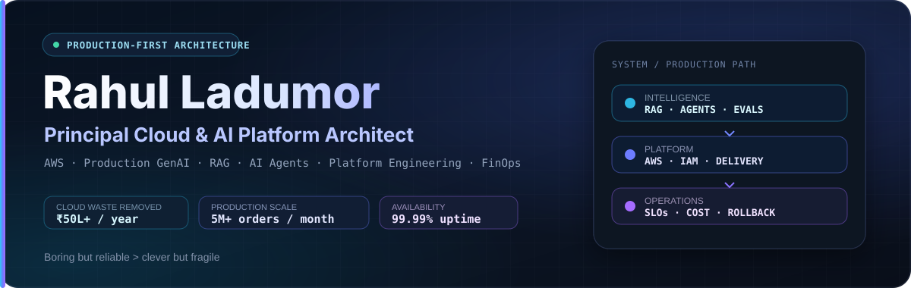

  

[Website](https://www.rahulladumor.com) · [LinkedIn](https://www.linkedin.com/in/rahulladumor/) · [InfraTales](https://infratales.com) · [Book a call](https://topmate.io/rahulladumor)

---

## I build production AI and cloud platforms that survive real traffic, real failure modes, and real cloud bills.

I am a Principal Cloud and AI Platform Architect with 9+ years of production engineering experience across AWS, serverless systems, platform reliability, GenAI infrastructure, and cloud cost control.

Teams usually bring me in when:

- an AI or RAG system works in a demo but fails under production conditions
- an AWS platform is expensive, fragile, difficult to secure, or difficult to operate
- architecture decisions need an experienced owner who can balance speed, reliability, cost, and blast radius

| Production scale | Cost impact | Credentials |
|:--:|:--:|:--:|
| **5M+ orders/month** at sub-200ms and 99.99% uptime | **₹50L+/year** of AWS waste removed | **3x AWS Professional** and **4x AWS Community Builder** |

> I prefer boring but reliable over clever but fragile. Every architecture decision should make cost, failure behaviour, operational ownership, and rollback clear.

---

## What I solve

<table>
<tr>
<td width="33%" valign="top">

### Production AI platforms

Amazon Bedrock, RAG, agents, evaluations, guardrails, observability, prompt and tool governance, and production deployment patterns.

</td>
<td width="33%" valign="top">

### AWS platform reliability

Serverless and container platforms, multi-region design, observability, incident reduction, safe releases, IAM boundaries, and rollback planning.

</td>
<td width="33%" valign="top">

### Cloud cost control

Architecture-led FinOps, right-sizing, storage lifecycle design, connection and compute optimisation, token budgets, and spend guardrails.

</td>
</tr>
</table>

---

## Selected production work

### KFC Thailand - omnichannel ordering at national scale

| | |
|---|---|
| **Problem** | High-volume ordering across channels required consistent latency, safe releases, and operational resilience. |
| **Scale** | 5M+ orders/month, sub-200ms response time, 99.99% uptime, 20+ releases/week. |
| **Architecture** | Event-driven services on Kubernetes with Kafka, Terraform, blue-green deployment, and production observability. |
| **Outcome** | A platform capable of handling peak ordering demand without trading delivery speed for reliability. |

### AWS cost optimisation - ₹50L+ annual waste removed

| | |
|---|---|
| **Problem** | Cloud spend had grown without clear ownership, evidence, or durable controls. |
| **Scope** | Compute, storage, serverless concurrency, database usage, connection behaviour, and operational waste. |
| **Approach** | Evidence-first audit, right-sizing, lifecycle controls, architecture changes, and governance that remained after the engagement. |
| **Outcome** | More than ₹50L/year in avoidable AWS spend removed. |

### Turing - IaC validation and AI-assisted infrastructure delivery

| | |
|---|---|
| **Problem** | Infrastructure tasks needed consistent validation across repositories and IaC frameworks. |
| **Scale** | 1,745 tasks across Terraform, CDK, CDKTF, Pulumi, and CloudFormation. |
| **Architecture** | Multi-repository validation, CI/CD repair workflows, automated curation, and repeatable quality gates. |
| **Outcome** | 96.3% validated task quality across a 12-repository ecosystem. |

---

## Current builds

<table>
<tr>
<td width="33%" valign="top">

### [IdleLens](https://idlelens.com)

**Building**

Read-only AWS waste scanner that turns resource evidence into prioritised savings recommendations. Built around safe onboarding, multi-account scanning, and confidence-based findings.

`AWS · Next.js · TypeScript · Fargate`

</td>
<td width="33%" valign="top">

### [InfraTales](https://infratales.com)

**Launched**

A practical AWS and AI infrastructure publication focused on what broke, what it cost, what changed, and how the system was made safer.

[Explore the GitHub organisation](https://github.com/InfraTales)

</td>
<td width="33%" valign="top">

### AI agent telemetry

**Private prototype**

A control plane for coding-agent sessions, tool calls, cost, memory, approval gates, and evidence retention across local and cloud execution.

`Claude Code · OpenTelemetry · TypeScript · Python`

</td>
</tr>
</table>

---

## Open-source evidence

| Repository | Why it matters |
|---|---|
| [AWS cost optimisation case study](https://github.com/InfraTales/infratales-aws-cost-optimization-50l-case-study) | Shows an evidence-led approach to reducing cloud waste without introducing operational risk. |
| [Enterprise secure web application](https://github.com/InfraTales/enterprise-secure-webapp-3tier) | Demonstrates production-oriented AWS architecture, IAM, networking, deployment, and operational controls. |
| [Zero-trust network architecture](https://github.com/InfraTales/zero-trust-network-architecture) | Explores identity-aware access and smaller blast-radius design for enterprise environments. |

[Explore all InfraTales projects](https://github.com/orgs/InfraTales/repositories)

---

## Technical focus

**AWS:** Lambda, API Gateway, DynamoDB, EventBridge, Step Functions, ECS, EKS, RDS, S3, CloudFront, IAM, VPC, OpenSearch, Bedrock, SageMaker

**Platform:** Terraform, CDK, CloudFormation, GitHub Actions, Kubernetes, Docker, observability, incident response, release engineering

**AI:** RAG, agents, tool execution, evaluations, guardrails, prompt and trace governance, LangChain, LangGraph, RAGAS, LangSmith

**Languages:** TypeScript, Node.js, Python, Go

---

## Credentials

**3x AWS Professional Certified** · **4x AWS Community Builder - Serverless** · **HashiCorp Terraform Associate** · **PG Certificate in Agentic AI, GenAI and ML - IIT Roorkee**

I have worked across production systems for teams in the US, Canada, Japan, Thailand, Indonesia, and India, including high-volume commerce, enterprise standards, cloud security, AI platforms, and infrastructure automation.

---

## Engineering activity

<!-- STATS:START (auto-updated weekly by .github/workflows/update-stats.yml) -->

  
  
  

  
  
  
  
  
  

<!-- STATS:END -->

---

## Work with me

I take on selected consulting and fractional architecture engagements involving production GenAI, AWS platform reliability, and cloud cost control.

**A good engagement starts with a concrete system problem:** architecture risk, production instability, cost leakage, AI reliability, or a delivery bottleneck that needs senior technical ownership.

[Book an architecture call](https://topmate.io/rahulladumor) · [Visit rahulladumor.com](https://www.rahulladumor.com) · [Connect on LinkedIn](https://www.linkedin.com/in/rahulladumor/)

