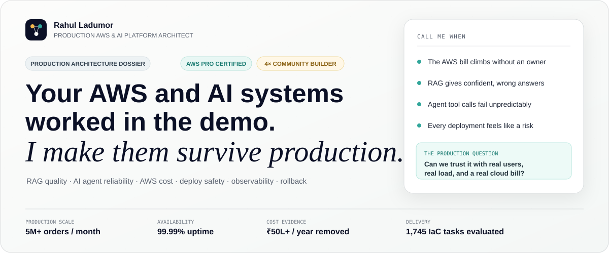
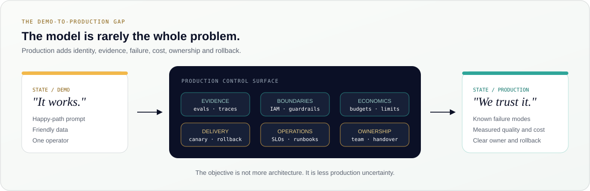

<picture>
  <source media="(prefers-color-scheme: dark)" srcset="./assets/profile-cover-dark.svg">
  <source media="(prefers-color-scheme: light)" srcset="./assets/profile-cover-light.svg">
  
</picture>

<h1 align="center">Production AWS &amp; AI Platform Architect</h1>

<p align="center">
  I find the failure, cost and ownership risks between <b>"the demo worked"</b> and <b>"we trust it in production."</b>
</p>

<div align="center">

[Run a Production Review](https://www.rahulladumor.com/contact?intent=production-review) · [Inspect production evidence](#production-evidence) · [Explore open source](#open-source-proof) · [Read architecture notes](https://www.rahulladumor.com/writing)

</div>

<br/>

```text
SYSTEM PROFILE
role        Principal Cloud & AI Platform Architect
specialty   Production GenAI · RAG · AI agents · AWS platforms · FinOps
default     Boring but reliable > clever but fragile
status      Available for selected reviews, sprints and fractional ownership
```

> ### 3:47 AM — the call I get hired for
>
> Most engagements start the same way: something is on fire, the AWS bill stopped making sense, or a GenAI system is falling apart under real traffic. I find what is bleeding, stop it, and make sure it cannot happen again — the boring, reliable kind of system that does not wake you up at 3 AM.


---

## Choose your route

| If you are... | Start here |
|---|---|
| **A CTO or founder** | [What you can bring me](#what-you-can-bring-me) and [production evidence](#production-evidence) |
| **A platform or engineering leader** | [The production control surface](#the-production-control-surface) and [architecture decisions](#architecture-decision-records) |
| **A hiring manager** | [Professional verification](#professional-verification) and [technical operating range](#technical-operating-range) |
| **An engineer or community member** | [Open-source proof](#open-source-proof) and [systems under construction](#systems-under-construction) |

---

## The production signal

The model is rarely the whole problem.

A production AWS or AI system also needs evidence, identity boundaries, observability, failure isolation, cost ceilings, safe delivery, rollback, and an owner who knows what happens next.

<table>
<tr>
<td width="50%" valign="top">

### AI risk signals

- RAG retrieves plausible but incorrect evidence
- an AI agent loses context or fails during tool execution
- quality is discussed but not continuously evaluated
- prompts, traces and sensitive data lack clear governance
- model cost cannot be tied to a business unit or workflow

</td>
<td width="50%" valign="top">

### Platform risk signals

- the AWS bill increases without technical ownership
- every deployment feels risky
- rollback exists on paper but is not rehearsed
- serverless or container workloads fail under real traffic
- dashboards exist, but incidents still take hours to explain

</td>
</tr>
</table>

---

## The production control surface

<picture>
  <source media="(prefers-color-scheme: dark)" srcset="./assets/trust-gates-dark.svg">
  <source media="(prefers-color-scheme: light)" srcset="./assets/trust-gates-light.svg">
  
</picture>

| Gate | Questions I expect the system to answer |
|---|---|
| **Evidence** | How do we know retrieval, tool execution and output quality are improving rather than drifting? |
| **Boundaries** | Which identity can read, write, invoke or approve each action, and what is the blast radius? |
| **Economics** | What does one useful outcome cost today, and what happens at 10× traffic? |
| **Delivery** | How is the change validated, released gradually and rolled back? |
| **Operations** | Which signals detect failure before the customer reports it? |
| **Ownership** | Who receives the alert, makes the decision and maintains the control after handover? |

> The objective is not more architecture. It is less production uncertainty.

---

## What you can bring me

<table>
<tr>
<td width="50%" valign="top">

### 01 / Production Review

A fixed-scope review for an AWS or AI system that is live or approaching launch.

**Good fit:** rising cloud cost, reliability risk, latency, weak observability, unsafe deployment, migration planning, or unclear rollback.

**Output:** evidence-backed findings, severity, architecture decisions, recommended sequence and next actions.

[Review the service](https://www.rahulladumor.com/services)

</td>
<td width="50%" valign="top">

### 02 / GenAI and RAG Readiness

A launch review for RAG, AI agents and Amazon Bedrock workloads.

**Good fit:** retrieval quality, hallucination exposure, tool reliability, evaluations, guardrails, trace governance and cost-per-request.

**Output:** failure-mode analysis, evaluation plan, production controls and launch blockers.

[Review the service](https://www.rahulladumor.com/services)

</td>
</tr>
<tr>
<td width="50%" valign="top">

### 03 / Implementation Sprint

A scoped engineering sprint that closes one important production gap.

**Typical work:** RAG hardening, AWS cost controls, observability, IaC repair, IAM boundaries, deployment safety or rollback automation.

**Rule:** measurable acceptance criteria and a known rollback path before implementation begins.

[Discuss a sprint](https://www.rahulladumor.com/contact)

</td>
<td width="50%" valign="top">

### 04 / Fractional Platform Architect

Ongoing technical ownership without hiring a full-time Principal Architect.

**Typical work:** design reviews, architecture standards, cost governance, production decisions, reliability direction and team mentoring.

**Role:** senior judgment where architecture, product delivery and operations meet.

[Discuss fractional ownership](https://www.rahulladumor.com/contact)

</td>
</tr>
</table>

---

<a id="production-evidence"></a>
## Production evidence

| System | Scale | Risk controlled | Evidence |
|---|---:|---|---|
| **KFC Thailand ordering** | 5M+ orders/month | Availability, latency and release risk | Sub-200ms response time and 99.99% uptime |
| **Enterprise GenAI and RAG** | 2M+ documents | Retrieval quality, latency and LLM spend | Sub-second retrieval with semantic caching |
| **AI-assisted infrastructure validation** | 1,745 IaC tasks | AI-generated infrastructure quality | 96.3% validated task quality across five IaC frameworks |
| **AWS cost optimisation** | Multi-service estate | Waste without ownership or durable controls | ₹50L+ annual avoidable spend removed |

The numbers are useful. The decision trail behind them is more important.

---

## Architecture decision records

### ADR / High CPU was a symptom, not the diagnosis

| | |
|---|---|
| **Signal** | Redis reached 100% CPU with 1,620 open connections and degraded an indexing pipeline. |
| **Failure chain** | Unbounded key scan, weak connection handling, shared workload contention and unsafe credentials. |
| **Rejected shortcut** | Increasing capacity without removing the application and ownership failures. |
| **Decision** | Repair the application path and isolate the workload through a cost-neutral Valkey 7.2 migration. |
| **Production control** | Phased change, explicit rollback, credential remediation and post-migration validation. |
| **Outcome** | Smaller blast radius and a system the operating team could explain and own. |

### ADR / RAG quality is an operating metric

| | |
|---|---|
| **Signal** | A convincing answer could still be unsupported, slow or economically unviable. |
| **Decision** | Measure retrieval, latency and unit economics separately instead of collapsing quality into one prompt score. |
| **Control surface** | Ingestion validation, retrieval evidence, semantic caching, evaluations, traces and cost-per-request. |
| **Outcome** | Search across more than 2M documents with sub-second retrieval and lower model spend. |

---

*More decision records — including AI-generated infrastructure validation — at [InfraTales](https://github.com/InfraTales).*

## Systems under construction

<table>
<tr>
<td width="33%" valign="top">

### [IdleLens](https://idlelens.com)

`BUILDING · v0.6.0`

**AWS waste evidence engine**

A read-only scanner that converts resource evidence into prioritised findings with confidence, estimated monthly impact and a suggested operator action.

`AWS · Next.js · TypeScript · Fargate`

</td>
<td width="33%" valign="top">

### [InfraTales](https://infratales.com)

`LAUNCHED · 7 Apr 2026`

**Architecture field notes**

An engineering publication and open-source organisation documenting what broke, what it cost, what changed and how the system became safer.

[Explore InfraTales](https://github.com/InfraTales)

</td>
<td width="33%" valign="top">

### AI Agent Telemetry

`BUILDING · prototype`

**Private control-plane prototype**

Session evidence, tool calls, cost, memory, approval gates, redaction, retention and review paths across coding-agent execution.

`Claude Code · OpenTelemetry · TypeScript · Python`

</td>
</tr>
</table>

---

## Open-source proof

| Repository | Production question it answers |
|---|---|
| [AWS cost-optimisation case study](https://github.com/InfraTales/infratales-aws-cost-optimization-50l-case-study) | How do you remove AWS waste without creating operational risk? |
| [Enterprise secure web application](https://github.com/InfraTales/enterprise-secure-webapp-3tier) | How should networking, IAM, deployment and operations fit together? |
| [Zero-trust network architecture](https://github.com/InfraTales/zero-trust-network-architecture) | How do identity-aware controls reduce blast radius? |
| [InfraTales repositories](https://github.com/orgs/InfraTales/repositories) | How do architecture patterns become reusable infrastructure? |

---

## Technical operating range

<div align="center">
  
</div>

<br/>

| Domain | Production focus |
|---|---|
| **AWS architecture** | Lambda, API Gateway, DynamoDB, EventBridge, Step Functions, SQS, ECS, EKS, RDS, S3, CloudFront, IAM, VPC, OpenSearch |
| **Production GenAI** | Amazon Bedrock, RAG, AI agents, tool execution, evaluations, guardrails, prompt and trace governance, semantic caching |
| **Platform engineering** | Terraform, CDK, CloudFormation, GitHub Actions, Kubernetes, Docker, CI/CD and multi-account foundations |
| **Reliability engineering** | Observability, SLOs, incident analysis, failure isolation, canary delivery, blue-green delivery and rollback |
| **Cost and FinOps** | Evidence-led right-sizing, lifecycle policies, idle-resource analysis, unit economics, budgets and spend guardrails |
| **Languages** | TypeScript, Node.js, Python and Go |

---

## Professional verification

<div align="center">
<table>
<tr>
<td align="center" width="33%">
<br/>
<b>Solutions Architect</b><br/><sub>AWS Professional</sub>
</td>
<td align="center" width="33%">
<br/>
<b>Generative AI Developer</b><br/><sub>AWS Professional</sub>
</td>
<td align="center" width="33%">
<br/>
<b>DevOps Engineer</b><br/><sub>AWS Professional</sub>
</td>
</tr>
</table>
</div>

<div align="center">

**3× AWS Professional Certified** · **4× AWS Community Builder - Serverless** · **HashiCorp Terraform Associate**

**PG Certificate in Agentic AI, Generative AI and Machine Learning - IIT Roorkee**

Upwork Top Rated · AWS community organiser · Technical speaker · Surat, India · Working worldwide

</div>

---

## Engineering activity

<!-- STATS:START (auto-updated weekly by .github/workflows/update-stats.yml) -->
<p align="center">
  
  
  
</p>

<p align="center">
  
  
  
  
  
  
</p>
<!-- STATS:END -->

---

## Bring me the system that has to survive

A useful first conversation starts with evidence: the architecture, the current failure or cost signal, the operating constraints and what the business cannot afford to get wrong.

<div align="center">

### [Run a Production Review](https://www.rahulladumor.com/contact?intent=production-review)

[rahulladumor.com](https://www.rahulladumor.com) · [hello@rahulladumor.com](mailto:hello@rahulladumor.com) · [LinkedIn](https://www.linkedin.com/in/rahulladumor/) · [InfraTales](https://infratales.com)

</div>
